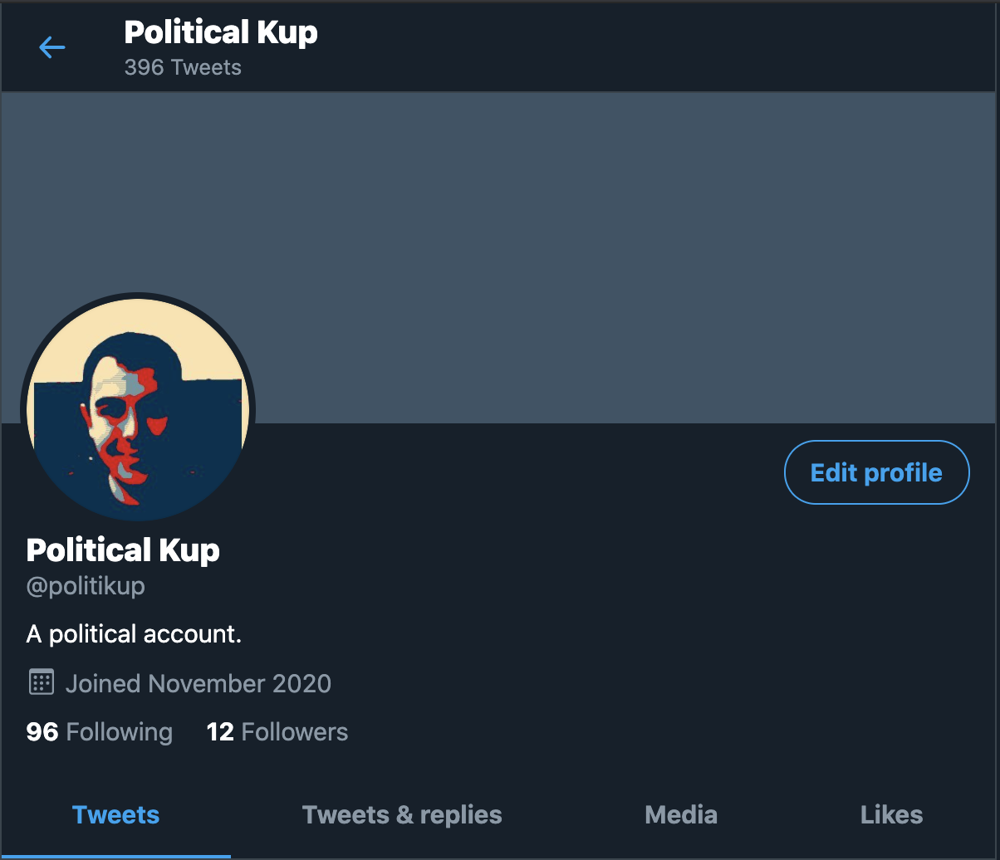

I've always been interested in political Twitter. At the time of this writing, the Twitter account with the most followers is [President Barack Obama](https://twitter.com/BarackObama)'s with a staggering 126.6 **million** followers.

With the 2020 election being dramatic and so drawn out, I found myself wanting to Tweet a lot and I'm always terrified of losing followers so I decided to make a brand new account just to Tweet about politics.

Enter [@politikup](https://twitter.com/politikup).

## The Beginning

So I made the account (which was an entire blog post of a process itself!). Then I went and followed a bunch of political accounts I like and some I hate and was off to the races!

### Stage 1, Shouting into the abyss

I don't have a ton of followers on my main account. But, at the time of this writing [https://twitter.com/jkup](@jkup) has just over 9,000. I was pretty surprised with my new account how little interaction I'd get! To this day, I think my standalone Tweets have gotten 0 interactions. My replies have done pretty well but more on that later!

Twitter is a pretty lonely place for new signups. I kept getting kicked out of my account and having to do a Google reCAPTCHA to get back in. But I was pretty happy just liking and ReTweeting as much as I wanted with no fear of being judged!

### Stage 2, Political Tweets go viral

On the flip side, early replies to Twitter accounts with many followers can get a LOT of traction. A few innocuous replies got hundreds of likes, dozens of retweets, and quite a few threats from (hopefully) spam #MAGA accounts. Here are a few examples:

https://twitter.com/politikup/status/1328503923989241857

https://twitter.com/politikup/status/1331310057569611779

### Stage 3, I am drained

I think I noticed a feeling of fatigue on the first day. The news cycle is endless, there is a lot to be anxious about and replying to accounts just begets more replies. I did have a couple of positive conversations with hardcore Trumpers where I feel like we honestly came to some common grounds. I got blocked by quite a few accounts (including 2 senators!).

I'm going to stop using the account. It was an enjoyable outlet for a few days but something about Political Twitter is so noise heavy, so angry, so never ending that it's had a significant affect on me.

### Stage 4, I want to help build, not critique or convince

Ever since Georgia went blue in this latest election, I've been reading a lot about [Stacey Abrams](https://twitter.com/staceyabrams). She served in the House of Representatives for 10 years and then in 2018 she ran for Governor of Georgia. After a highly contested election, she lost. And instead of wallowing in defeat she immediately went to work. She started organizations like [Fair Fight](https://fairfight.com/) and has devoted her life to fighting for Americans (Georgians in particular) to make sure they have a right to vote.

After all the major news networks called Georgia for President-elect Joe Biden, I began seeing all of these Tweets attributing the win got Stacey. Her tireless work fighting for voter rights paid off in a big way.

That got me thinking about how we spend our time. There is, without doubt, a big problem in America right now. As politicians attempt to subvert democracy and disenfranchise people in every state. One way of fighting against it is to call out this behavior! Another way to fight it is simply to vote for a better alternative. But the more I think about it, the more I want to spend my time building something amazing and inspiring like Stacey has. I don't want to waste my time quibbling with folks I disagree with. I want to help build something great and help folks I believe in!
