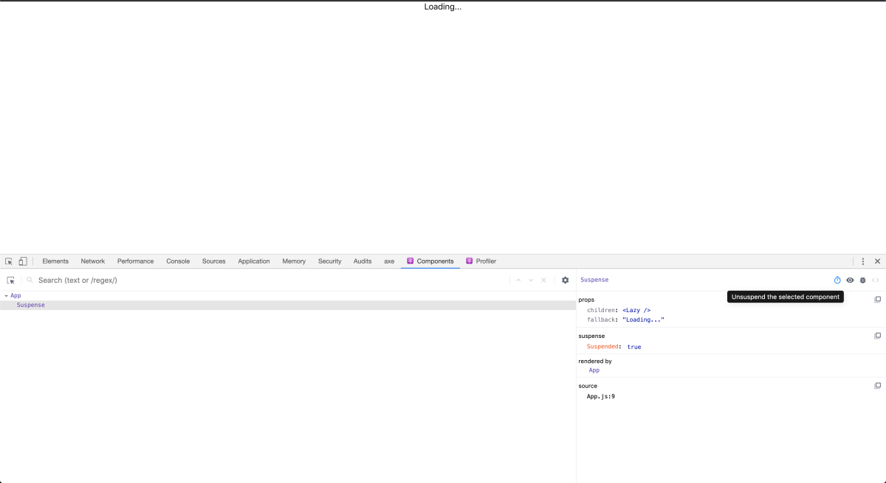

Today we’re going to learn how to manually suspend a React Component by using the React DevTools.

Let’s start by using [create-react-app](https://github.com/facebook/create-react-app) to make a very basic Hello World.

Open your terminal and type in the following:

```shell
npx create-react-app suspense-demo
cd suspense-demo
npm start
```

That should open a new tab in your browser and you should see the Create React App welcome page, which looks like this.


Now let’s open the suspense-demo folder in your favorite text editor. Inside the src/ folder next to App.js create a new file and call it Suspendable.js. Put the following inside.

```javascript
import React from "react";

function Suspendable() {
  return <div>Finished Loading!</div>;
}

export default Suspendable;
```

Now open App.js and let’s replace the current contents with your Suspendable component, wrapped in a React.Suspense tag.

```javascript
import React from "react";
import "./App.css";

const Suspendable = React.lazy(() => import("./Suspendable"));

function App() {
  return (
    <div className="App">
      <React.Suspense fallback="Loading...">
        <Suspendable />
      </React.Suspense>
    </div>
  );
}

export default App;
```

Now if you go back to your browser you’ll see your Suspense component loading, but it likely happens too quickly and you’ll never see “Loading…” you’ll just see “Finished Loading!”.

If you want to test the React component in its suspended state you can do so by installing the [React DevTools](https://chrome.google.com/webstore/detail/react-developer-tools/fmkadmapgofadopljbjfkapdkoienihi?hl=en) and opening up the Components tab. Click on your Suspendable component in the list and then click the little stopwatch icon in the sidebar to suspend the component.



Click the highlighted button to suspend a React component.
